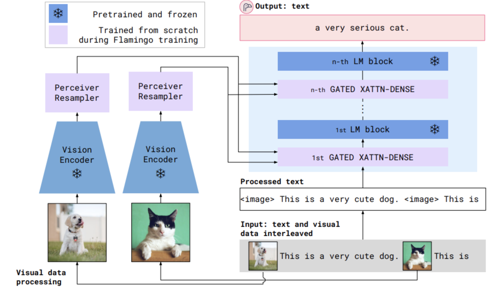
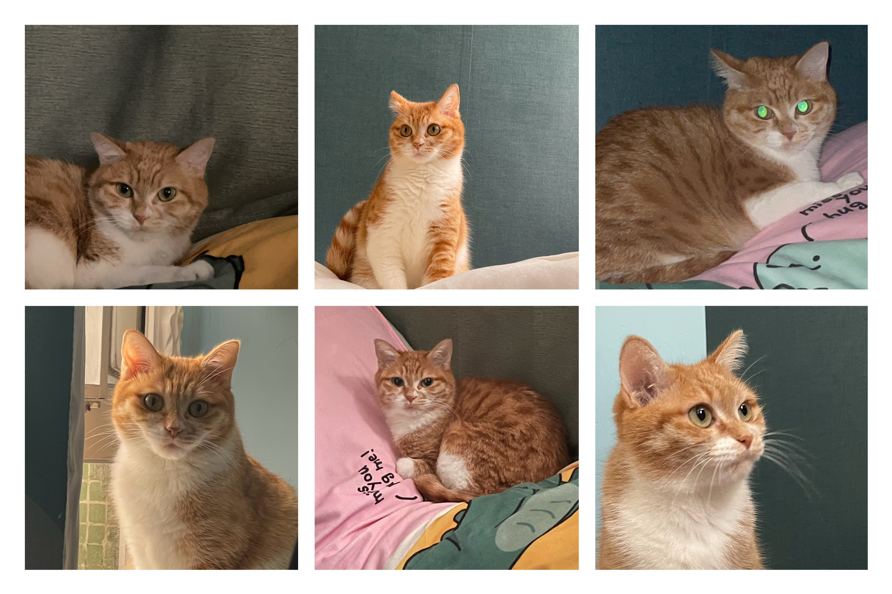
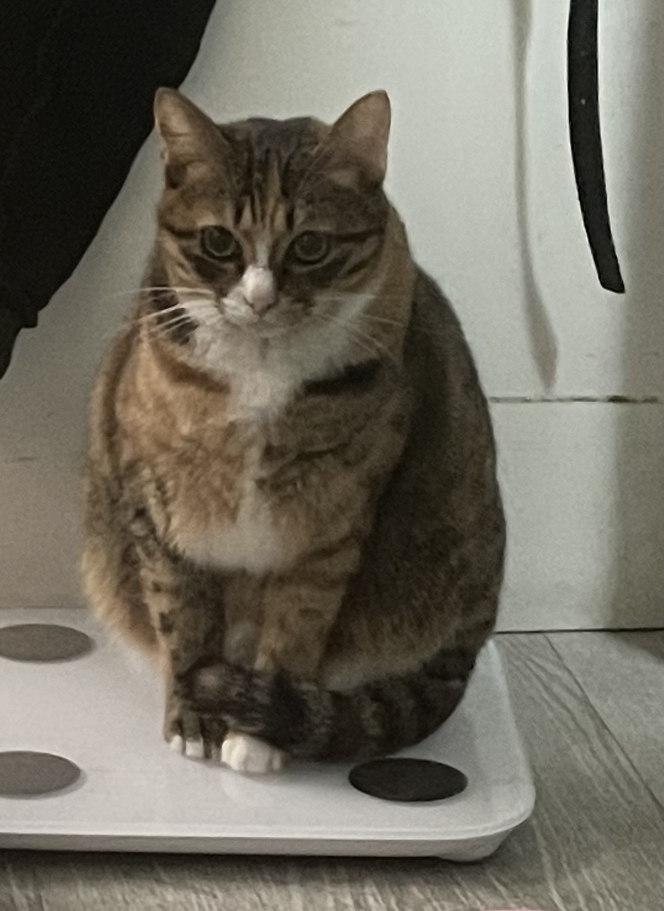

# COMP7404-Project-Flamingo

This is the implementation of a demo using Flamingo for few-shot image classification and simple OCR (Optical Character Recognition).

## Quick Start

- [Model Structure](#Architecture)
- [Demo](#Examples)
- [Set-up](#Set-up)
  
## Architecture

<p align="center">
  
</p>

## Examples
### Few-shot Classification for cats

**Input**

_Category 1_:

Text input: An image of a cat named Hanbao :hamburger: .
<p align="center">
  
</p>

_Category 2_:

Text input: An image of a cat named Tuanzi :dango: .
<p align="center">
  
</p>

_Test Case_:

Text input: An image of a cat named 
<p align="center">
  
</p>

**Output**

An image of a cat named tuanzi.

### Simple OCR for University Logos

**Input**

Text Input: This is the logo of {University Name}

Images Input:
<p align="center">
  
</p>

_Test Case_:

Text Input: This is the logo of 

Images Input:
<p align="center">
  
</p>

**Output**
This is the logo of the university of hong kong

## Set-up

### Installation
To install related packages, run the following code to set up the environment.
```
pip install -r requirements.txt
```

### Run
**Run Cats Classification**
```
python flamingo.py --class_1_path=PATH_TO_HANBAO --class_2_path=PATH_TO_TUANZI --test_cases_path=PATH_TO_TESTCASES 
```

